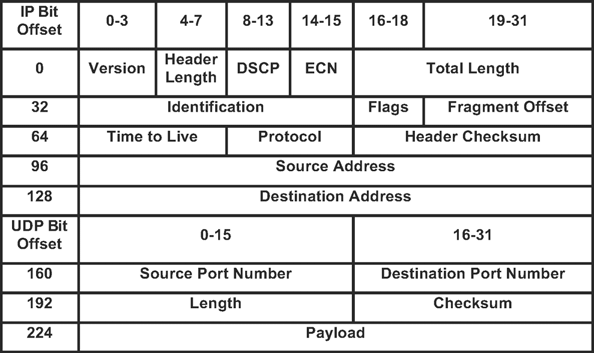
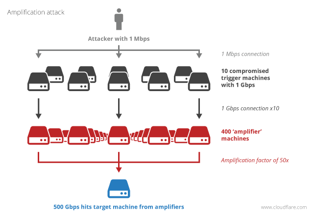
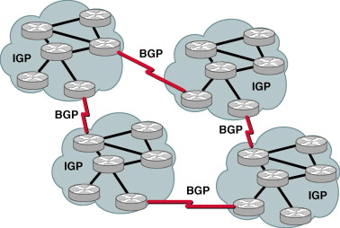
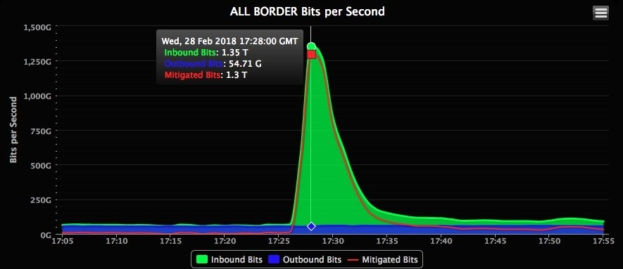
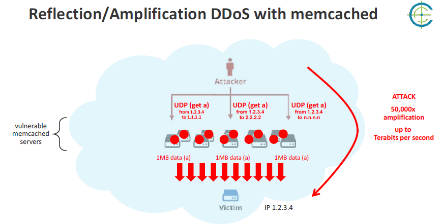

<!--
To run this presentation, please run:

./node_modules/.bin/reveal-md ddos/index.md -w --theme blood
-->

<style>

span.highlight, .reveal em {
  color: #9c2232;
  font-weight: bold
}

.reveal code {
  color: #9c2232;
}

.reveal {
  font-size: 35px
}

.reveal h1 {
  font-size: 2.7em
}

.reveal h2 {
  font-size: 1.7em
}

.reveal h3 {
  font-size: 1.2em
}
</style>

# DDOS
## Distributed denial of service attacks

Quick intro with three samples and mitigation strategies

---

## Who am I?
* Nicolás Andrade, Tech Lead of the Stash team
* Former Tech Lead for multiple High-traffic top-100 websites
* Former Code Auditor in Information Security
* Have been working at SSENSE for around 2 years (Joined November 21st 2017)

---

# DDOS

---
**DDoS** is short for _Distributed Denial of Service_.

A type of attack where multiple compromised systems are used to target a single system causing a _Denial of Service_ (DoS) attack.

Victims of a DDoS attack consist of both the end targeted system and all systems maliciously used and controlled by the hacker in the distributed attack, often with a Trojan.

----

## Distributed

Where multiple compromised systems are used to target a single system causing a Denial of Service (DoS) attack.


----

## Denial of service

* Most DDoS attacks are designed to consume all available network bandwidth or resources on a target network, system, or website. 
* The attacker uses one of many available methods and tools to flood the target with a barrage of malicious or nuisance requests, or to abuse a protocol or inherent vulnerability in such a way that the system can no longer respond to requests. 


Note: imagine a situation where you send friends to a line up of the bus that comes to the office, with fake Opus cards. Real bus users will be delayed because of people that won't even take the bus. They are just disrupting the quality of the service.

----

## DDOS

Average attack volumes grew by 194% in 12 months

* In Q4 2018, average attack volumes were 5Gbps, nearly treble the 1.7Gbps average seen in Q4 2017.
* Attackers are using increasingly powerful botnets comprising misused cloud servers, hijacked IoT devices and embedded devices.

----

## DDOS

* More complex multi-vector attacks: The majority (59%) of attacks in Q4 2018 were multi-vector attacks, compared with 45% in Q4 2017. The most complex attacks seen in Q4 used up to nine different attack vectors. The three most commonly used reflection amplification vectors were CLDAP, DNS reflection and SSDP.

---

#### Some network basics


Note: layer 3 and 4 is where we filter packets based on source and destination (transport)

---

# TCP SYN-Flood DDOS

----

#### How does TCP work?


----

#### TCP SYN-Flood DDoS

The TCP SYN-Flood attack exploits the TCP 3-way handshake mechanism.


----

#### TCP SYN-Flood DDoS

* Attacker sends a `SYN`.
* The server allocates memory to handle a new TCP connection.
* The server replies with a `SYN-ACK` and waits for an `ACK` from the client.
* ...and waits.
* ...and waits.


* While the server waits, the attacker sends a new `SYN`.
* The server replies with a `SYN-ACK`...


----

#### TCP SYN-Flood DDoS

* The server resources are exhausted:
  * too much memory is allocated for an excessive amount of time, to handle connections that won't ever be established.
* The server commits too much!

----

### SYN-Flood Mitigation techniques

1. **Reduce** the amount of memory allocated for a possible upcoming connection
  * Allocate 16 bytes during the SYN
  * Allocate more memory when the ACK is received

----

### SYN-Flood Mitigation techniques

2. **Reduce** the server's time-window for the ACK, so if memory is allocated, at least it is not wasted for too long.
  * Downside is that clients with slow connections might not manage to establish a TCP connection in the expected timeframe.
  * The downside is usually mitigated by edge servers.

----

### SYN-Flood Mitigation techniques

3. **RST cookies**: for the first request from a given client, the server intentionally sends an invalid SYN-ACK. This would result in the client generating an RST packet, which tells the server something is wrong. If this happens, the server knows the request is legitimate, logs the client, and accepts subsequent incoming connections from it.

----

### SYN-Flood DDOS

Questions?

----

# Good

Because I don't know any better

---

## NTP Amplification Attack

----

### NTP works through UDP

* *User Datagram Protocol*, known as **UDP** is a protocol of the Internet protocol suite, RFC 768.
* It is a **stateless protocol** : a communications protocol in which no session information is retained by the receiver, usually a server.


Note: Relevant session data is sent to the receiver by the client in such a way that every packet of information transferred can be understood in isolation, without context information from previous packets in the session. This property of stateless protocols makes them ideal in high volume applications, increasing performance by removing server load caused by retention of session information.

----

### Stateful vs stateless

<span class="highlight">TCP is stateful</span>: both client and server have some _session_ information and know the _context_ of the exchange.

<span class="highlight">UDP is stateless</span>: no party is aware of the previous messages. There is no _session_ nor _context_.

Note: Stateful is like a phone call. You open a connection and both parties know who they are talking to.
Stateless is a letter sent by mail. The envelope says who is the sender and who is the receiver. But no other context information.

----

### UDP Packet



An application can spoof the _source address_ as it's part of the message, pretending to be someone else.

----

### NTP Protocol

The _Network Time Protocol_ (**NTP**) is a networking protocol for clock synchronization between computer systems over packet-switched, variable-latency data networks. In operation since before 1985, NTP is one of the oldest Internet protocols in current use. 

----

### NTP Amplification Attack

If the client can spoof the IP in a UDP packet, then the client can ask a server _Hey! I'm someone else. What time is it?_
And the server will send the response to the IP listed as `source`.

----

## Amplification?

A standard NTP request size is 56 bytes.

A standard NTP response size is 56 bytes.

The amplification factor is 1.

----

## NTP MonList

_monlist_, (or _MON_GETLIST_) is a command that can be sent to NTP servers for debugging purposes.

The server will reply with a list of up to 600 clients that were served lastly.

A monlist request size is around 234 bytes long.

Each response packet is 446 bytes long, and contains 6 addresses.

----

You could send a _monlist_ request to a server, spoofing the _source IP_ in the UDP request to pretend you're someone else.

The server will reply to the _source IP_ with the whole list of the 600 last served IPs.

In other words, 43Kb of responses:

```
(600 IPs) / (6 IPs per packet) = 100 packets
(100 Packets) * (446 bytes per packet) = 43Kb
(Response size, 44600) / (Request size, 234) = 190
```

The amplification factor is around 190x !

----

##### Amplification



----

#### Mitigation techniques

* If you host an NTP server, disable the _monlist_ command.
* If you are an BGP operator -often a big ISP- , ensure that you don't pass NTP packets along if the Source IP looks strange.

----

### What is BGP?

The _Border Gateway Protocol_ is the protocol that binds different networks to build the Internet.



Note: the internet is a network of networks. Different networks connect to each other through border-gateway nodes that know which networks are on each side. BGP routes traffic between networks in such a way that a connection from network A to network B should pass at least one border.

----

* BGP should drop NTP requests coming from a network when the packet's Source IP does not belong to the originating network.
* This does not avoid the problem, but reduces the attack surface. See <a href="https://tools.ietf.org/html/bcp38">BCP-38</a> for details

Note: BCP stands for Internet Best Current Practices, BCP-38 was drafted in May 2000.
A similar technique can be done with DNS, as DNS is also UDP based.

----
```

3. Restricting forged traffic

   The problems encountered with this type of attack are numerous, and
   involve shortcomings in host software implementations, routing
   methodologies, and the TCP/IP protocols themselves.  However, by
   restricting transit traffic which originates from a downstream
   network to known, and intentionally advertised, prefix(es), the
   problem of source address spoofing can be virtually eliminated in
   this attack scenario.

                               11.0.0.0/8
                                   /
                               router 1
                                 /
                                /
                               /                       204.69.207.0/24
         ISP <----- ISP <---- ISP <--- ISP <-- router <-- attacker
          A          B         C        D         2
                    /
                   /
                  /
              router 3
                /
            12.0.0.0/8


   In the example above, the attacker resides within 204.69.207.0/24,
   which is provided Internet connectivity by ISP D.  An input traffic
   filter on the ingress (input) link of "router 2", which provides
   connectivity to the attacker's network, restricts traffic to allow
   only traffic originating from source addresses within the
   204.69.207.0/24 prefix, and prohibits an attacker from using
   "invalid" source addresses which reside outside of this prefix range.
```


----

### NTP Amplification Attack

Questions?

----

# Good

Because I don't know any better

---

### Slow HTTP Attack

_Slow HTTP attacks_ are denial-of-service (DoS) attacks in which the attacker sends HTTP requests in pieces slowly, one at a time to a Web server. If an HTTP request is not complete, or if the transfer rate is very low, the server keeps its resources busy waiting for the rest of the data.

When the server’s concurrent connection pool reaches its maximum, this creates a DoS. Slow HTTP attacks are easy to execute because they require only minimal resources from the attacker.


Note: it's similar to someone talking to you very slowly. You spend time waiting for the next word, and during that time you can not establish a new connection with anyone else.

----

### Slow HTTP Attack

#### Normal HTTP Request
```
> GET / HTTP/1.1
> Host: ssense.com
> User-Agent: Chrome V1.1 ...

< HTTP/1.1 200 Ok.
< Server: Varnish
< Retry-After: 0
< Content-Length: 0
```

----

### Slow HTTP Attack

#### Malicious HTTP Request
```
> GET / HTTP/1.1
(wait 10 seconds)
> Host: ssense.com
(wait 10 seconds)
> User-Agent: Chrome V1.1 ...
(wait 10 seconds)
> Inexistent-Header-Number-One: RandomValue
(wait 10 seconds)
> Inexistent-Header-Number-Two: RandomValue
(wait 10 seconds)
...
```

----


### Slow HTTP Attack

#### Mitigation

1. Use Edge nodes. We use Incapsula, but CloudFlare or any other edge service would work. They will take care of the attack.
2. Decrease the connection timeout limits.
3. Define the minimum incoming data rate, and drop connections that are slower than that rate. Care must be taken not to set the minimum too low, or you risk dropping legitimate connections.

---

### Slow HTTP Attack

Questions?

----

# Good

Because I don't know any better

---

### Biggest DDOS attack ever seen

It took place in February 2018, against _GitHub_. 



----

## GitHub DDOS attack

At its peak, this attack saw incoming traffic at a rate of 1.3 terabytes per second (Tbps), sending packets at a rate of 126.9 million per second.

This was a _memcached DDoS attack_, so there were no botnets involved. Instead the attackers leveraged the _amplification_ effect of a this caching system.

Memcache supports UDP. Attackers flooded memcached servers with spoofed requests, amplifying their attack by a magnitude of about 50.000x

Note: explain how big a memcache request is, and how big the response can be.

----

### Memcahed makes things... faster?



---

### What can you do?
* Ensure your IoT devices are not accessible from the Internet. If possible, block their access to the Internet as well.
* Do not leave any open server, and remove unused, stale servers from the Internet.
* Since packet manipulation requires _root_ privileges, _disable root_ accesses and accounts.
* Disable the UDP interfaces for services that have a request-response flow

---
### Resources

* https://www.shodan.io/ - Database of Internet devices.
* https://scapy.net/ - Manipulates all kind of packets.

---

### Thanks for attending!
