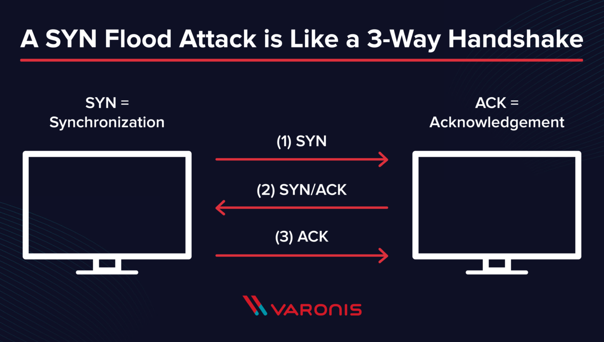

# DDOS
## Distributed denial of service attacks

Quick intro with three samples and mitigation strategies

---

## Who am I?
* Nicolás Andrade, Tech Lead of the Stash team
* About 15 years of experience;
* Used to be Tech Lead for around 7 years for multiple High-traffic top-100 websites
* Used to be Code Auditor in the Information Security department for 1 year
* Have been working at SSENSE for around 2 years (Joined November 21st 2017)

---

## Some network basics

(show the 7 layers)

---

## How does TCP work?

---

## TCP SYN-Flood Distributed Denial of Service attack
### Theory

The TCP SYN-Flood attack exploits the TCP 3-way handshake mechanism.

* Attacker sends a SYN.
* The server allocates memory to handle a new TCP connection.
* The server replies with a SYN-ACK and waits for an ACK from the client.
* ...and waits.
* ...and waits.
* While the server waits, the attacker sends a new SYN.
* The server replies with a SYN-ACK...

---

## TCP SYN-ACK Distributed Denial of Service attack
### Affected components
* The server resources are exhausted because too much memory is allocated for an excessive amount of time, to handle connections that won't ever be established.
* The server commits too much!

---

## TCP SYN-ACK Distributed Denial of Service attack
### Mitigation techniques

1. Reduce the amount of memory allocated for a possible upcoming connection
  * Allocate 16 bytes during the SYN
  * Allocate more memory when the ACK is received

2. Reduce the server's time-window for the ACK, so if memory is allocated, at least it is not wasted for too long.

---

