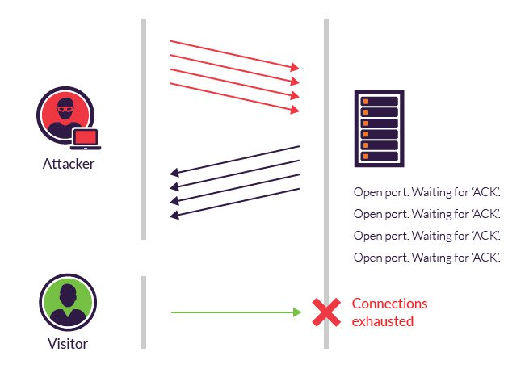

<!--
To run this presentation, please run:

./node_modules/.bin/reveal-md ddos/index.md -w --theme blood
-->

# DDOS
## Distributed denial of service attacks

Quick intro with three samples and mitigation strategies

---

## Who am I?
* Nicolás Andrade, Tech Lead of the Stash team
* Used to be Tech Lead for around 7 years for multiple High-traffic top-100 websites
* Used to be Code Auditor in the Information Security department for 1 year
* Have been working at SSENSE for around 2 years (Joined November 21st 2017)

---

**DDoS** is short for _Distributed Denial of Service_.

A type of attack where multiple compromised systems are used to target a single system causing a Denial of Service (DoS) attack.

Victims of a DDoS attack consist of both the end targeted system and all systems maliciously used and controlled by the hacker in the distributed attack, often with a Trojan.

---

#### Some network basics

---

# TCP SYN-Flood DDOS

---

#### How does TCP work?

---

#### TCP SYN-Flood Distributed Denial of Service attack

The TCP SYN-Flood attack exploits the TCP 3-way handshake mechanism.

---

#### TCP SYN-Flood Distributed Denial of Service attack

* Attacker sends a `SYN`.
* The server allocates memory to handle a new TCP connection.
* The server replies with a `SYN-ACK` and waits for an `ACK` from the client.
* ...and waits.
* ...and waits.
* While the server waits, the attacker sends a new `SYN`.
* The server replies with a `SYN-ACK`...

---

### TCP SYN-Flood Distributed Denial of Service attack

* The server resources are exhausted:
  * too much memory is allocated for an excessive amount of time, to handle connections that won't ever be established.
* The server commits too much!

---

### SYN-Flood Mitigation techniques

1. **Reduce** the amount of memory allocated for a possible upcoming connection
  * Allocate 16 bytes during the SYN
  * Allocate more memory when the ACK is received

----

### SYN-Flood Mitigation techniques

2. **Reduce** the server's time-window for the ACK, so if memory is allocated, at least it is not wasted for too long.
  * Downside is that clients with slow connections might not manage to establish a TCP connection in the expected timeframe.
  * The downside is usually mitigated by edge serviers.

----

### SYN-Flood Mitigation techniques

3. **RST cookies**: for the first request from a given client, the server intentionally sends an invalid SYN-ACK. This would result in the client generating an RST packet, which tells the server something is wrong. If this happens, the server knows the request is legitimate, logs the client, and accepts subsequent incoming connections from it.

---

### SYN-Flood DDOS

Questions?

----

# Good

Because I have no idea

---

## NTP Amplification Attack

---

### NTP and UDP

* *User Datagram Protocol*, known as **UDP** is a protocol of the Internet protocol suite, RFC 768.
* It is a **stateless protocol** : a communications protocol in which no session information is retained by the receiver, usually a server.

Note: Relevant session data is sent to the receiver by the client in such a way that every packet of information transferred can be understood in isolation, without context information from previous packets in the session. This property of stateless protocols makes them ideal in high volume applications, increasing performance by removing server load caused by retention of session information.

---

### UDP Packet

----

### UDP Packet

What matters here is that the application can spoof the _source address_ as it's part of the message.

---

### NTP Protocol

The _Network Time Protocol_ (**NTP**) is a networking protocol for clock synchronization between computer systems over packet-switched, variable-latency data networks. In operation since before 1985, NTP is one of the oldest Internet protocols in current use. 

---

### NTP Amplification Attack

If the client can spoof the IP in a UDP packet, then the client can ask a server _Hey! I'm someone-else's IP. what time is it?_
And the server will send the response to the IP listed as `source`.

---

## Amplification?

A standard NTP request size is 56 bytes.

A standard NTP response size is 56 bytes.

The amplification factor is 1.

----

## NTP MonList

_monlist_, (or _MON_GETLIST_) is a command that can be sent to NTP servers for debugging purposes.

The server will reply with a list of up to the last 600 clients.

A monlist request size is around 234 bytes long.

Each response packet is 446 bytes long, and contains 6 addresses.

----

You could send a _monlist_ request to a server, spoofing the _source IP_ in the UDP request to pretend you're someone else.

The server will reply to the _source IP_ with the whole list of the 600 last-served IPs.

In other words, 43Kb of responses.

The amplification factor is around 190x !

---

##### Amplification

----

#### Mitigation techniques

* If you host an NTP server, disable the _monlist_ command.
* If you are an BGP operator, ensure that you don't pass NTP packets along from one network to another when the Source IP 

----

### What is BGP?

The **Border Gateway Protocol**  is the protocol that binds different networks to build the Internet.

----

* BGP should drop NTP requests coming from a network when the packet's Source IP does not belong to that network.
* This does not avoid the problem, but reduces the attack surface. See <a href="https://tools.ietf.org/html/bcp38">BCP-38</a> for details

Note: BCP stands for Internet Best Current Practices, BCP-38 was drafted in May 2000.
A similar technique can be done with DNS, as DNS is also UDP based.
